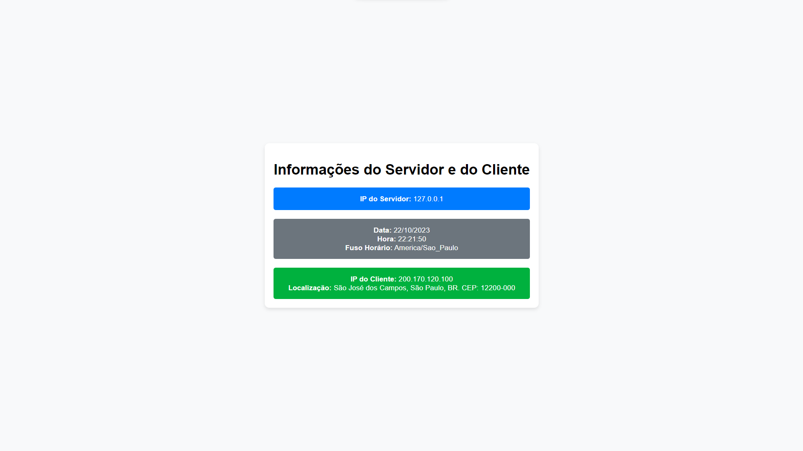
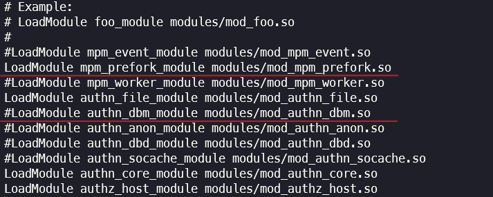

# NAT Web Server

Welcome to the NAT Web Server repository, a project developed for computer networks at UNIFESP (Universidade Federal de São Paulo). This repository, authored by Matheus Silva [@matheuxito](https://www.github.com/matheuxito), hosts a PHP website using Apache. The site displays server information, including dynamic details such as server name, current time, date, and time zone information.

<div align="center">
    
</div>

## Setup Instructions (Arch Linux with Yay)

Follow these steps to set up the NAT Web Server on your Arch Linux system using Yay package manager.

### 1. Update your system

```bash
sudo yay -Syu
```

### 2. Install Apache

```bash
sudo yay -S apache
```

Start the server and check its status:

```bash
sudo systemctl start httpd 
sudo systemctl enable httpd
sudo systemctl status httpd
```

### 3. Install PHP and configure Apache

```bash
sudo yay -S php php-apache
sudo nano /etc/httpd/conf/httpd.conf
```

Edit the configuration file to match the provided image:



Add the following lines at the end of the file:

```apache
LoadModule php_module modules/libphp.so
AddHandler php-script php
Include conf/extra/php_module.conf
```


Restart the Apache web server:

```bash
sudo systemctl restart httpd
```

### 4. Clone and test the repository

Clone the repository:

```bash
git clone https://github.com/matheuxito/NAT-Web-Server.git
```

Copy the project to the web server directory:

```bash
sudo cp -r NAT-Web-Server /srv/http
```

Now, you can access the PHP page at:

```
127.0.0.1/NAT-Web-Server/index.php
```

### 5. Access the page from another network via mobile using Ngrok

To access the NAT Web Server from another network via mobile, you can use Ngrok, a service that creates secure tunnels to localhost. Follow these steps to set up Ngrok and access your server remotely.

#### Install Ngrok

First, install Ngrok using Yay package manager:

```bash
sudo yay -S ngrok
```

Next, visit the [Ngrok website](https://ngrok.com/) to create an account and obtain an authentication token.

After obtaining your token, add it to your Ngrok configuration:

```bash
ngrok config add-authtoken <your-auth-token>
```

#### Start a Tunnel

Start a tunnel to your local web server (assuming it's running on port 80, which is the default for Apache):

```bash
ngrok http 80
```

Ngrok will provide you with a public URL, such as `https://randomstring.ngrok-free.app`. You can access the project remotely by appending `/NAT-Web-Server` to the end of this URL:

```
https://randomstring.ngrok-free.app/NAT-Web-Server/
```

Now you can access the project from any network via your mobile device or any other device with an internet connection.

Please note that Ngrok provides a temporary public URL.

## License

This project is licensed under the MIT License - see the [LICENSE](LICENSE) file for details.