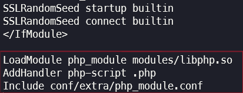

# NAT Web Server

Welcome to the NAT Web Server repository, a project developed for computer networks at UNIFESP (Universidade Federal de São Paulo). This repository, authored by Matheus Silva [@matheuxito](https://www.github.com/matheuxito), hosts a PHP website using Apache. The site displays server information, including dynamic details such as server name, current time, date, and time zone information.

<div align="center">
    
</div>

## Setup Instructions (Arch Linux with Yay)

Follow these steps to set up the NAT Web Server on your Arch Linux system using Yay package manager.

### 1. Update your system:

```bash
sudo yay -Syu
```

### 2. Install Apache:

```bash
sudo yay -S apache
```

Start the server and check its status:

```bash
sudo systemctl start httpd 
sudo systemctl enable httpd
sudo systemctl status httpd
```

### 3. Install PHP and configure Apache:

```bash
sudo yay -S php php-apache
sudo nano /etc/httpd/conf/httpd.conf
```

Edit the configuration file to match the provided image:


Add the following lines at the end of the file:

```apache
LoadModule php_module modules/libphp.so
AddHandler php-script php
Include conf/extra/php_module.conf
```



Restart the Apache web server:

```bash
sudo systemctl restart httpd
```

### 4. Clone and test the repository:

Clone the repository:

```bash
git clone https://github.com/matheuxito/NAT-Web-Server.git
```

Copy the project to the web server directory:

```bash
sudo cp -r NAT-Web-Server /srv/http
```

Now, you can access the PHP page at:

```
localhost/NAT-Web-Server/index.php
```

### 5. Access the page from another network via mobile

\[Coming soon...\]

## License

This project is licensed under the MIT License - see the [LICENSE](LICENSE) file for details.